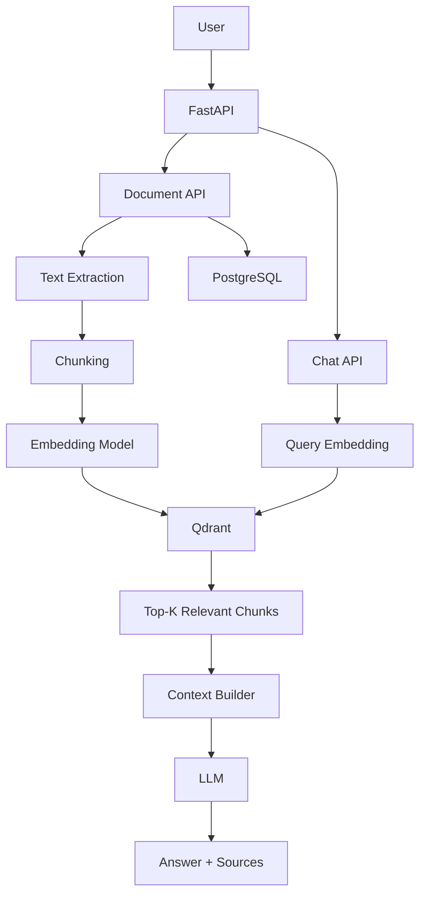

# RAG Document Search

A production-oriented Retrieval-Augmented Generation (RAG) system for semantic document search and question answering.

The system allows users to upload documents, extract and chunk their content, generate vector embeddings, store them in Qdrant, retrieve relevant document chunks, and use an LLM to generate answers based on the retrieved context.

---

## Architecture



---

## RAG Pipeline

### Document Ingestion

```text
Document
   |
   v
Text Extraction
   |
   v
Text Chunking
   |
   v
Embedding Model
   |
   v
Vector Embeddings
   |
   v
Qdrant
```

### Question Answering

```text
User Question
      |
      v
Query Embedding
      |
      v
Qdrant Similarity Search
      |
      v
Top-K Relevant Chunks
      |
      v
Context Construction
      |
      v
LLM
      |
      v
Answer + Sources
```

---

## Features

- PDF document ingestion
- Text extraction
- Document chunking
- Semantic embeddings
- Vector similarity search
- PostgreSQL metadata storage
- Qdrant vector database
- Retrieval-Augmented Generation
- LLM-based question answering
- Source chunk tracking
- Document-specific retrieval
- FastAPI REST API
- Swagger/OpenAPI documentation
- SQLAlchemy ORM
- Alembic database migrations
- Docker-based infrastructure
- CPU-based embedding inference

---

## Technology Stack

| Component | Technology |
|---|---|
| Programming Language | Python |
| API Framework | FastAPI |
| Database | PostgreSQL 16 |
| ORM | SQLAlchemy |
| Database Migration | Alembic |
| Vector Database | Qdrant |
| Embedding Model | `all-MiniLM-L6-v2` |
| Embedding Dimension | 384 |
| LLM | OpenAI-compatible API |
| Infrastructure | Docker Compose |
| Package Manager | uv |

---

# Project Structure

```text
rag-document-search/
|
├── app/
│   ├── api/
│   │   ├── chat.py
│   │   └── documents.py
│   │
│   ├── core/
│   │   ├── config.py
│   │   └── dependencies.py
│   │
│   ├── models/
│   │   ├── document.py
│   │   ├── document_content.py
│   │   └── document_chunk.py
│   │
│   ├── repositories/
│   │   ├── document_repository.py
│   │   └── document_chunk_repository.py
│   │
│   ├── schemas/
│   │   ├── chat.py
│   │   └── document.py
│   │
│   ├── services/
│   │   ├── chunking_service.py
│   │   ├── context_service.py
│   │   ├── embedding_service.py
│   │   ├── llm_service.py
│   │   ├── qdrant_service.py
│   │   └── retrieval_service.py
│   │
│   └── main.py
│
├── docs/
│   ├── architecture.md
│   ├── api.md
│   ├── rag-pipeline.md
│   └── setup.md
│
├── migrations/
├── tests/
├── .env.example
├── .gitignore
├── docker-compose.yml
├── README.md
└── pyproject.toml
```

---

# System Components

## FastAPI

FastAPI provides the REST API layer.

Main endpoints:

```text
POST /documents
POST /chat
```

Swagger documentation:

```text
http://localhost:8000/docs
```

---

## PostgreSQL

PostgreSQL stores structured application data and document metadata.

Typical entities include:

```text
documents
document_contents
document_chunks
```

PostgreSQL acts as the source of truth for application-level data.

---

## Qdrant

Qdrant is used for vector storage and semantic similarity search.

Each document chunk is converted into a vector:

```text
Text
 |
 v
Embedding Model
 |
 v
384-dimensional vector
 |
 v
Qdrant
```

The vector is stored together with metadata such as:

```json
{
  "chunk_id": "...",
  "document_id": "...",
  "chunk_index": 3,
  "text": "..."
}
```

---

## Embedding Model

The project uses:

```text
sentence-transformers/all-MiniLM-L6-v2
```

Embedding dimension:

```text
384
```

The embedding model is configured to run on CPU:

```python
SentenceTransformer(
    settings.embedding_model,
    device="cpu",
)
```

This makes the project easy to run on development machines without a CUDA-enabled GPU.

---

## LLM

The generation layer uses an OpenAI-compatible API.

The LLM receives:

```text
System Instructions
        +
Retrieved Context
        +
User Question
```

and generates the final answer.

The LLM provider can be changed through configuration without changing the retrieval architecture.

---

# RAG Workflow

## 1. Document Upload

The user uploads a document through the API.

```text
PDF
 |
 v
FastAPI
```

Document metadata is stored in PostgreSQL.

---

## 2. Text Extraction

The text is extracted from the document.

```text
PDF
 |
 v
Text Extraction
 |
 v
Raw Text
```

---

## 3. Chunking

Large documents are split into smaller pieces.

```text
Document
 |
 ├── Chunk 1
 ├── Chunk 2
 ├── Chunk 3
 ├── ...
 └── Chunk N
```

Chunking improves retrieval quality because the embedding model works with smaller semantic units.

---

## 4. Embedding

Each chunk is converted into a numerical vector.

```text
Document Chunk
      |
      v
Embedding Model
      |
      v
384-dimensional vector
```

---

## 5. Vector Storage

The vectors are stored in Qdrant.

```text
Chunk
 |
 ├── Text
 ├── Metadata
 └── Embedding
          |
          v
        Qdrant
```

---

## 6. Query Processing

When a user asks a question:

```text
"What programming languages does the candidate know?"
```

the question is converted into an embedding using the same embedding model.

```text
Question
   |
   v
Embedding Model
   |
   v
Query Vector
```

---

## 7. Semantic Search

The query vector is sent to Qdrant.

Qdrant performs vector similarity search and returns the most relevant chunks.

```text
Query Vector
     |
     v
   Qdrant
     |
     v
 Top-K Chunks
```

---

## 8. Context Construction

The retrieved chunks are combined into a context for the LLM.

Example:

```text
[Source 1]

The candidate has extensive experience with Python...

[Source 2]

He has also worked with C++ and C#...

[Source 3]

His recent projects were primarily implemented in Python...
```

---

## 9. LLM Generation

The context and question are passed to the LLM.

```text
Context
   +
Question
   |
   v
  LLM
   |
   v
Answer
```

The API also returns the retrieved source chunks.

This makes the response traceable and easier to debug.

---

# API

## POST `/documents`

Uploads and processes a document.

```http
POST /documents
```

The document is processed through the ingestion pipeline.

---

## POST `/chat`

Ask a question about the indexed documents.

Example request:

```json
{
  "question": "What programming languages does the candidate know?",
  "top_k": 5
}
```

Optional document filtering:

```json
{
  "question": "What programming languages does the candidate know?",
  "document_id": "document-uuid",
  "top_k": 5
}
```

Example response:

```json
{
  "answer": "The candidate has experience with Python, C++ and C#.",
  "sources": [
    {
      "chunk_id": "chunk-uuid",
      "document_id": "document-uuid",
      "chunk_index": 3,
      "text": "Python, C++, C#...",
      "score": 0.87
    }
  ]
}
```

---

# Setup

## Requirements

- Python 3.11+
- Docker
- Docker Compose
- uv
- Linux/macOS/WSL

---

## 1. Clone the repository

```bash
git clone <repository-url>
cd rag-document-search
```

---

## 2. Install dependencies

Using `uv`:

```bash
uv sync
```

---

## 3. Configure environment variables

Create the environment file:

```bash
cp .env.example .env
```

Do not commit `.env`.

---

# Infrastructure

Start PostgreSQL and Qdrant:

```bash
docker compose up -d
```

Check the containers:

```bash
docker compose ps
```

Expected services:

```text
postgres
qdrant
```

---

# PostgreSQL

Default development configuration:

```text
Host:     localhost
Port:     5432
Database: rag
Username: postgres
Password: postgres
```

---

# Qdrant

Qdrant runs on:

```text
http://localhost:6333
```

Check the Qdrant collections:

```bash
curl http://localhost:6333/collections
```

---

# Database Migrations

Run migrations:

```bash
alembic upgrade head
```

Create a new migration:

```bash
alembic revision --autogenerate -m "description"
```

Rollback the latest migration:

```bash
alembic downgrade -1
```

---

# Run the Application

Start FastAPI:

```bash
uv run uvicorn app.main:app --reload
```

The API will be available at:

```text
http://localhost:8000
```

Swagger UI:

```text
http://localhost:8000/docs
```

---

# Testing

Run tests:

```bash
pytest
```

Test the retrieval pipeline:

```bash
uv run python tests/test_retrieval.py
```

Test the complete RAG pipeline:

```bash
uv run python tests/test_rag.py
```

---

# Current Limitations

The current implementation is intentionally focused on the core RAG pipeline.

Current limitations include:

- No conversation memory
- No streaming responses
- No authentication
- No rate limiting
- No hybrid keyword/vector search
- No CrossEncoder reranking
- No background processing queue
- No distributed workers
- No advanced retrieval evaluation
- No production observability

These are potential future improvements.

---

# Roadmap

```text
[x] FastAPI project setup
[x] PostgreSQL integration
[x] SQLAlchemy models
[x] Alembic migrations
[x] Document ingestion
[x] Text extraction
[x] Text chunking
[x] Sentence Transformer embeddings
[x] Qdrant integration
[x] Semantic retrieval
[x] LLM integration
[x] RAG chat endpoint
[x] Source tracking
[x] Docker infrastructure
[x] Project documentation

[ ] CrossEncoder reranking
[ ] Hybrid search
[ ] Query rewriting
[ ] Conversation history
[ ] Streaming responses
[ ] RabbitMQ background processing
[ ] Authentication
[ ] Rate limiting
[ ] Retrieval evaluation
[ ] LLM evaluation
[ ] Observability
[ ] CI/CD
```

---

# Future Architecture

```text
                         ┌──────────────┐
                         │    Client    │
                         └──────┬───────┘
                                |
                                v
                         ┌──────────────┐
                         │   FastAPI    │
                         └──────┬───────┘
                                |
                 ┌──────────────┴──────────────┐
                 |                             |
                 v                             v
          Document Pipeline              Retrieval Pipeline
                 |                             |
                 v                             v
             RabbitMQ                       Qdrant
                 |                             |
                 v                             v
              Workers                      Reranker
                 |                             |
                 v                             v
             Embeddings                    Context
                                               |
                                               v
                                              LLM
                                               |
                                               v
                                            Answer
```

---

# Documentation

Additional documentation:

- [Architecture](docs/architecture.md)
- [RAG Pipeline](docs/rag-pipeline.md)
- [API Documentation](docs/api.md)
- [Setup Guide](docs/setup.md)

---

# License

This project is licensed under the MIT License.
